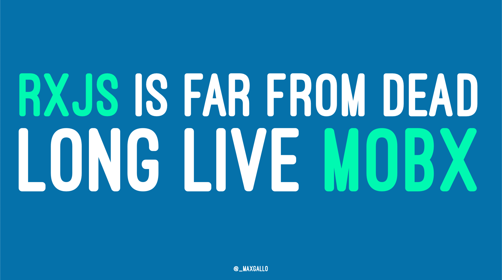

# RxJS is far from dead, long live MobX

Slides and example code of the talk

## Live Coding
In the talk there are two section of live coding.
"Before" is what we started with, and "after" is where we arrived.

### Live coding: MobX
- before: [mobx0.js](code/mobx0.js)
- after: [mobx1.js](code/mobx1.js)

### Live coding: RxJS
- before: [rxjs0.js](code/rxjs0.js)
- after: [rxjs1.js](code/rxjs1.js)

